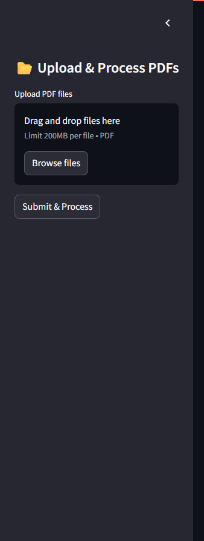

# Information Retrieval System

An interactive web app that allows users to upload PDF documents and ask questions about their content. The system uses advanced NLP and semantic search techniques to understand the text and provide relevant, conversational answers.

---

## Features

- Upload multiple PDF files and extract text automatically
- Split long documents into manageable chunks for efficient processing
- Create semantic embeddings of text chunks for similarity search
- Use vector search (FAISS) to find the most relevant document parts
- Generate answers to user questions using HuggingFace’s language models
- Maintain conversation context for follow-up questions
- Clean and user-friendly interface built with Streamlit

---

## Tech Stack

| Technology         | Purpose                                                |
|--------------------|--------------------------------------------------------|
| Python             | Core programming language                               |
| Streamlit          | Web app framework for UI                               |
| PyPDF2             | PDF text extraction                                    |
| LangChain          | Text splitting, memory management, conversational chains |
| HuggingFace        | Pretrained language models & embeddings                |
| FAISS              | Fast vector similarity search                          |
| dotenv             | Environment variable management                         |

---
## Screenshots

### Upload PDF and Ask Question

